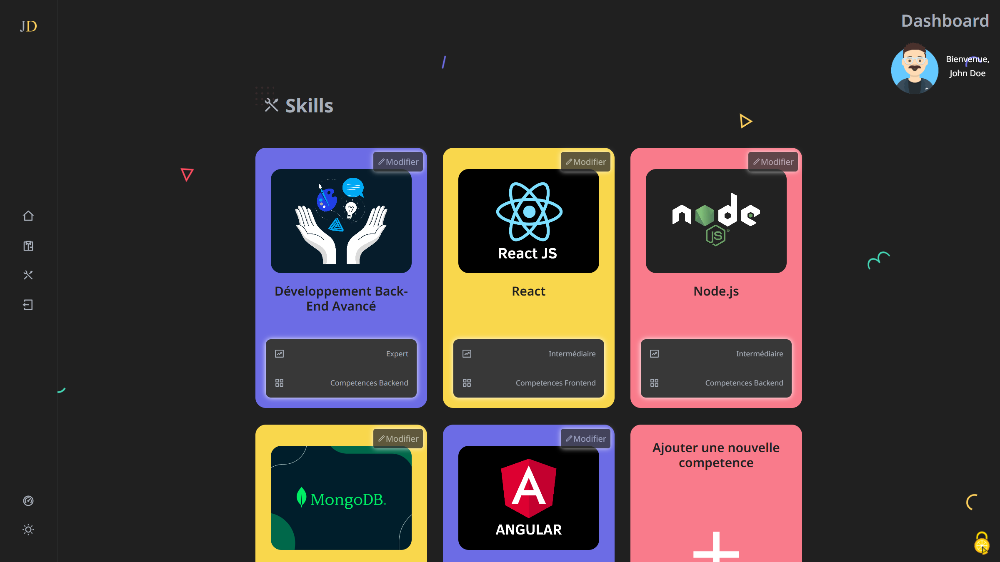
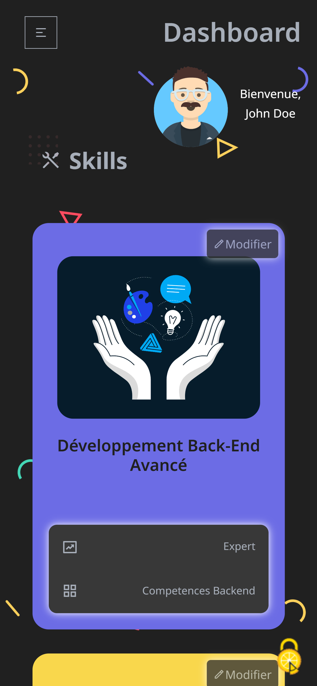

<p align="center" >
  
  
  
  
  
  
  
</p>

 

# Portfolio Website with Admin Dashboard

A full-stack portfolio website built with React and Node.js, featuring user authentication, admin dashboard, and GDPR-compliant cookie management. The project was made for an evaluation.

## Table of Contents

- [Portfolio Website with Admin Dashboard](#portfolio-website-with-admin-dashboard)
  - [Table of Contents](#table-of-contents)
  - [Features](#features)
  - [Tech Stack](#tech-stack)
    - [Frontend](#frontend)
    - [Backend](#backend)
  - [Getting Started](#getting-started)
    - [Prerequisites](#prerequisites)
    - [Installation](#installation)
  - [Demo](#demo)
  - [Credits](#credits)

## Features

- 🎨 Modern and responsive design with dark/light theme support
- 🔒 Secure authentication system
- 👩‍💼 Admin dashboard for content management
- 🍪 GDPR-compliant cookie management using tarteaucitron.js
- 📱 Mobile-friendly interface
- 🔄 Dynamic content loading
- 📝 Skills and about section management

## Tech Stack

### Frontend

- **React with Vite**: For fast builds and instant HMR.
- **React Router DOM**: For routing.
- **Axios**: For API calls.
- **React Icons**: For icons.
- **useHooks**: A collection of modern, server-safe React hooks from the ui.dev team.
- **react-router-hash-link**: Hash link support for React Router.
- **react-google-recaptcha**: Google reCAPTCHA component for React.

### Backend

- **Node.js & Express.js**: Server-side runtime and web framework for building APIs.
- **MongoDB with Mongoose**: Database with schema-based solution for Node.js.
- **JWT**: For handling secure authentication via JSON Web Tokens.
- **UUID**: For generating unique IDs (used for refresh tokens).
- **Cookie-parser**: For managing cookies in requests and responses.
- **Bcrypt**: For password hashing.
- **Multer**: For handling file uploads.
- **File-type**: For file type validation.
- **Redis**: For caching.
- **Cloudinary**: For cloud image storage and transformation.
- **Winston & Morgan**: For logging requests and errors.
- **Express Validator**: For input validation in Express apps.
- **Compression**: For compressing responses.
- **Helmet**: For setting secure HTTP headers.
- **CORS**: Cross-Origin Resource Sharing support.
- **Axios**: For making HTTP requests.
- **express-rate-limit**: To limit repeated requests from the same IP.
- **Development tools**:
  - **Dotenv**: For managing environment variables.
  - **Nodemon**: For automatic server restart during development.
  - **Cross-env**: For setting environment variables across different OS

## Getting Started

### Prerequisites

- **Node.js (v14 or higher)**
- **MongoDB**
- **Cloudinary account (for image storage)**
- **Yarn (for dependency management)**

### Installation

**1. Clone the repository**

```bash
git clone https://github.com/armen-asriyan/eval-backend.git
cd eval-backend
```

**2. Install backend dependencies**

```bash
cd backend
yarn install
```

**3. Install frontend dependencies**

```bash
cd ../frontend
yarn install
```

**4. Create a .env file in the backend and frontend directories with the following configurations:**

Backend `.env` file:

```ini
PORT = 'YOUR_PORT'
DB_NAME = 'YOUR_DB_NAME'
MONGO_URI= 'YOUR_MONGODB_URI'
JWT_SECRET = 'YOUR_JWT_SECRET'

CLOUDINARY_NAME = 'YOUR_CLOUDINARY_NAME'
CLOUDINARY_API_KEY = 'YOUR_CLOUDINARY_API_KEY'
CLOUDINARY_API_SECRET = 'YOUR_CLOUDINARY_API_SECRET'

# NODE_ENV = 'development' the environment is set by the corresponding script in package.json

CLIENT_URL='YOUR_CLIENT_URL (for cors)'

RECAPTCHA_SECRET_KEY = 'YOUR_RECAPTCHA_SECRET_KEY'
```

Frontend `.env` file:

```ini
VITE_API_URL = 'YOUR_BACKEND_API_URL'

VITE_RECAPTCHA_SITE_KEY = 'YOUR_RECAPTCHA_SITE_KEY'
```

**5. Start the backend server**

```bash
cd backend
yarn run dev
```

**6. Run the frontend app**

```bash
cd ../frontend
yarn run dev
```

**7. Open your browser and navigate to `http://localhost:5173` (default Vite port)**

<p align="center">🚀 That's it! You should now have a fully functional portfolio website with admin dashboard.</p>

<p align="center">📌 Don't forget to create the first user with the `/register` endpoint</p>

## Demo

Desktop:


<br />
<br />

Mobile:



<br />
<h2 align="center">👉 <a href="https://eval-backend.vercel.app">Live Demo on Vercel</h2></a>
<br />

## Credits

- [Greg Sithole](https://github.com/GregSithole/gregsithole-react-portfolio) for the original template
- [AmauriC](https://github.com/AmauriC) for tarteaucitron.js
